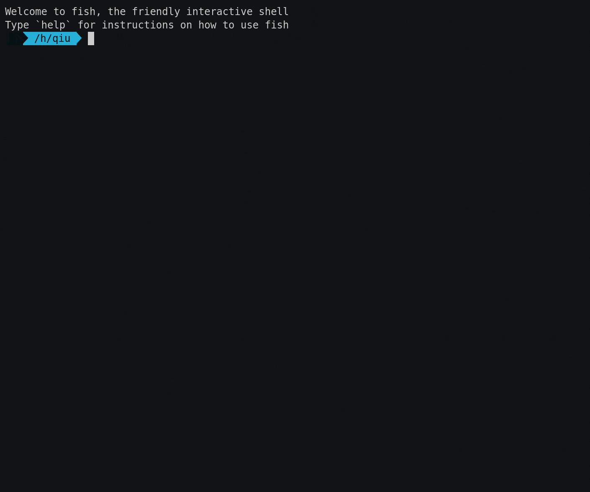

<!--
 * @Author: 源源圆球 1340793687@outlook.com
 * @Date: 2022-06-03 18:01:14
 * @LastEditors: 源源圆球 1340793687@outlook.com
 * @LastEditTime: 2022-06-06 11:17:38
 * @FilePath: /docker/README.md
 * Copyright (c) 2022 by 源源圆球 1340793687@outlook.com, All Rights Reserved. 
-->
# [绪山真寻BOT](https://github.com/HibiKier/zhenxun_bot)的Docker镜像🐋


**镜像内已集成运行BOT需要的PostgreSQL🐘、绪山真寻BOT本体、以及真寻BOT-WebUI😋**


顺手点个Star⭐呗~


## 需要知道🧐

你的机器需要有1G以上的空闲内存、2GB以上的空余储存空间

**先确定能用go-cqhttp登录上BOT的QQ，否则需要进入容器查看日志**

除了集成运行BOT必须的Python依赖之外，还有`rich`、`requests`、`jinja2`、`thefuzz`、`aiocache`、`baike`、`imageio`，这些是添加额外插件所需的常见依赖

镜像内并没有`git`、`vim`、`wget`等常用软件包，需要你自己安装

也没有`chromium`，需要的话进入容器执行`playwright install chromium`

## 迁移数据库📑

迁移数据库是为了如果你以前部署过真寻的话，可以继承好感度、金币等数据，当然你也可以迁移，它会自动新建

请先导出旧数据库，如果你使用的是真寻文档里的搭建方法，那么应该可以用`pg_dump --host 127.0.0.1 --port 5432 --username uname > zhenxun.sql testdb`这条命令导出数据库，它会问你密码，密码可能是`zhenxun`，之后会在当前目录变出来一个叫`zhenxun.sql`的文件，如果不成功的话最好看一下这条命令里面的主机地址和端口和数据库名字是不是对的，具体怎么看自己百度PostgreSQL怎么操作

然后将`zhenxun.sql`拷贝到将要部署Docker版真寻的宿主机的`~/my_plugins`目录下，**如果该目录不存在则需要手动创建**，然后就可以了，容器创建时会检测有没有这个文件，有的话就会帮你导入的，不过只是帮你导入，数据库本身有问题导致报错就跟我没关系

## 已知问题😥

无法使用`检查更新真寻`自动更新真寻，会报错`Invalid cross-device link: '/home/zhenxun_bot/plugins' -> '/home/zhenxun_bot/backup/plugins'`,我怀疑可能是docker使用的overlay文件系统的问题，希望有谁能帮我解决一下

跟真寻说`重启`之后重启成功也不会说已经重启完成，需要重启容器才会说，但是其实已经重启过了，**不影响使用**

## 快速开始🎉

将下面命令中**单引号内**的`bot的QQ号`、`bot的QQ密码`、`管理员QQ号`、`识图API-KEY`、`WebUI用户名`、`WebUI密码`替换成对应的账号和密码之后执行就好了

⚠识图API-KEY不替换也行，但是运行之后bot的识图功能会用不了，以后你想再加上的话需要进入容器自己更改，API_KEY通过[该网址](https://saucenao.com/user.php?page=search-api)注册获取

⚠会在当前用户的用户根目录里新建一个叫`my_plugins`的文件夹，这就是自定义插件的目录，同时里面也会有`WebUI`和`gocq`的日志文件，可以使用`cd ~/my_plugins`命令来进入

⚠第一次运行容器会有一个`已创建config.yaml，请重启bot`的提示，这个不用管，只要按我下面命令里一样设了自动重启的话容器会自动重启，**不影响使用**

```
docker run -itd --restart=on-failure:3 \
-e bot_qq='BOT的QQ号' \
-e bot_qq_key='BOT的QQ密码' \
-e admin_qq='管理员QQ号' \
-e api_key='识图API-KEY' \
-e webui_user='WebUI用户名' \
-e webui_passwd='WebUI密码' \
-p 8081:8081 \
-v ~/my_plugins:/home/zhenxun_bot/my_plugins \
--name=zhenxun_bot \
jyishit/zhenxun_bot
```

执行之后会开始从Docker Hub上下载镜像，下载并解压之后容器创建成功的话终端会返回一长串的容器ID，下载速度取决于你的网速，推荐设置一个[镜像加速器](https://www.runoob.com/docker/docker-mirror-acceleration.html)

查看Docker日志，成功运行之后可以去`容器IP:8081`进入真寻的WebUI

<div align="center"></div>

## 需要帮助🐱‍💻？

你可以点击图片加入QQ交流群、有关代码的问题可以提一个[Issue](https://github.com/SinKy-Yan/zhenxunbot-docker/issues/new)、别的东西可以发在[讨论](https://github.com/SinKy-Yan/zhenxunbot-docker/discussions)里

[](https://jq.qq.com/?_wv=1027&k=u8PgBkMZ)

## 容器内文件结构📂
```
/home
├── go-cqhttp
│   ├── data
│   ├── logs
│   ├── config.yml
│   ├── device.json
│   ├── go-cqhttp
│   └── session.token
├── zhenxun_bot
│   ├── .git
│   ├── .github
│   ├── basic_plugins
│   ├── configs
│   ├── data
│   ├── docs_image
│   ├── extensive_plugin
│   ├── log
│   ├── models
│   ├── my_plugins
│   ├── plugins
│   ├── resources
│   ├── services
│   ├── utils
│   ├── .env
│   ├── .env.dev
│   ├── .gitignore
│   ├── LICENSE
│   ├── README.md
│   ├── __version__
│   ├── bot.py
│   ├── logo.png
│   ├── poetry.lock
│   ├── pyproject.toml
│   ├── restart.sh
│   └── update_info.json
├── zhenxun_bot_webui
│   ├── .git
│   ├── dist
│   ├── node_modules
│   ├── public
│   ├── src
│   ├── .gitignore
│   ├── LICENSE
│   ├── README.md
│   ├── babel.config.js
│   ├── jsconfig.json
│   ├── package.json
│   ├── vue.config.js
│   └── yarn.lock
└── docker-entrypoint.sh